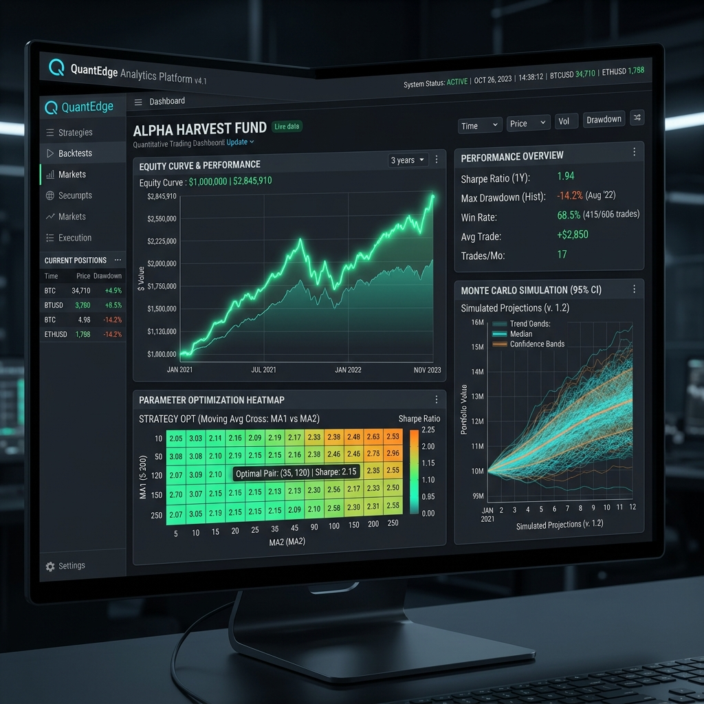

# TimeMachine QuantOptimizer 🚀

[](https://github.com/simon-hawk/TimeMachine-QuantOptimizer/actions)
[](https://www.python.org/)
[](https://opensource.org/licenses/MIT)



**TimeMachine QuantOptimizer** is a cutting-edge algorithmic backtesting and model optimization framework. Built to handle complex quantitative analysis, this environment provides researchers and traders with the tools to simulate, optimize, and validate quantitative trading models at high fidelity.

---

## 🌟 Key Features

*   **Advanced Micro-Tick Engine**: Simulates high-resolution market microstructure including next-bar open fill lag and deep liquidity profiles.
*   **Robust Strategy Library (StockSharp)**: Ships with 20 generic, highly-optimized StockSharp models for out-of-the-box benchmarking (MA Crossover, Breakouts, Mean Reversion, Ichimoku, Supertrend, etc.).
*   **Monte Carlo Stress Testing**: Rigorous resampling (IID Bootstrap, Politis-Romano Stationary Bootstrap, Shuffling) to test strategy durability across thousands of simulated alternate realities, producing statistically significant confidence intervals.
*   **Parallel Multiprocessing Optimizer**: High-throughput parameter space exploration scaling across multiple CPU cores (`mnq_backtester/core/optimizer.py`).
*   **Free Public Data Integrations**: Zero-setup historical data fetcher supporting Yahoo Finance, Stooq, and synthetic Merton Jump-Diffusion models (`mnq_backtester/data/fetcher.py`).
*   **Interactive Analytics Dashboard**: A full suite of visualizations, heatmaps, and performance summaries accessible locally.
*   **Automated Continuous Integration**: Comprehensive GitHub Actions workflow ensuring test reliability across Python versions.

---

## 📈 Parameter Optimization & Analytics

Optimize your systems over multi-year datasets, navigating parameter space efficiently to discover robust strategy configurations.


*3D representation of parameter surface optimization mapping Sharpe Ratio across multiple strategy dimensions.*

---

## ⚙️ Architecture

The system is separated into distinct, modular components designed for high-throughput quantitative workloads:

*   **`core/`**: The heart of the simulation, featuring the `BacktestEngine`, event-driven execution models, parallel optimizer, and fast vectorized math routines.
*   **`analytics/`**: Includes Deflated Sharpe calculations, Hierarchical Risk Parity, factor premia analysis, and structural turbulence diagnostics.
*   **`monte_carlo/`**: Stress-testing utilities using bootstrapping and resampling techniques to evaluate ruin probabilities and worst-case drawdowns.
*   **`data/`**: Continuous futures data handling, session filtering, validation, and zero-setup public data fetchers.
*   **`pinescript/`**: Utilities to interface with, parse, and benchmark TradingView PineScript models natively.
*   **`examples/`**: Interactive Jupyter notebooks and standalone demonstration scripts.

---

## 🚀 Getting Started

### Prerequisites

*   Python 3.9+ (Python 3.10 or 3.11 recommended)
*   Virtual Environment (recommended)

### Installation

Clone the repository and install the dependencies:

```bash
git clone https://github.com/simon-hawk/TimeMachine-QuantOptimizer.git
cd TimeMachine-QuantOptimizer
pip install -r requirements.txt
```

### Running the Test Suite

Run the built-in direct test runner to verify engine invariants:

```bash
python mnq_backtester/run_tests.py
```

### Quickstart Demonstration

Execute the standalone end-to-end demo script:

```bash
python examples/run_quickstart.py
```

Or open the interactive Jupyter notebook:

```bash
jupyter notebook examples/quickstart_tutorial.ipynb
```

### Launching the Dashboard

Fire up the local interactive analytics web server:

```bash
python -m mnq_backtester.dashboard.server --port 8050
```

*Navigate to `http://localhost:8050` in your web browser to view your strategy analysis.*

---

## 🛡️ Security & Privacy Notice

This repository contains the generalized, open-source framework of the QuantOptimizer platform. Proprietary algorithms, private API keys, and internal account configurations have been explicitly excluded from this public distribution.

---

*Designed for high-performance quantitative research and systematic trading development.*
